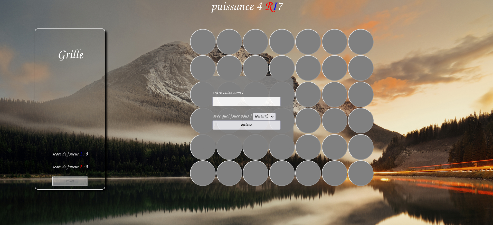

# Connect 4 Project

This project was completed as part of my training program. It's an implementation of the Connect 4 game using HTML, CSS, and JavaScript. The game allows you to play against another player or against the computer, where the computer randomly places pieces with a little animation upon victory.

## How to Play

1. Open the `index.html` file in your web browser.

2. Select the game mode:
   - **Two Players**: Two players can take turns clicking on the grid to place their pieces.
   - **Player vs. Computer**: Play against the computer, which randomly drops pieces.

3. Start playing, taking turns with your opponent or facing the computer.

4. The first player to connect 4 pieces of their color vertically, horizontally, or diagonally wins the game.

## Features

- Simple and intuitive user interface for a friendly gaming experience.
- Option to choose between two game modes.
- The computer plays randomly in "Player vs. Computer" mode.
- Automatic detection of the game's end and announcement of the winner.
- Animation upon victory.

Enjoy playing Connect 4!
